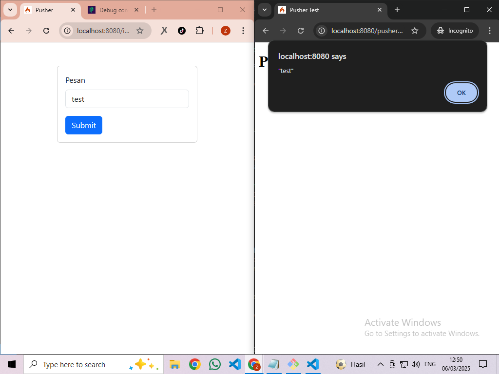

# Pusher + CodeIgniter 4

## Teknologi

- PHP 8.2.12
- Codeigniter 4.0
- MariaDB 10.4.32
- Pusher 7.2

## Screenshot

## License

The Codeigniter framework is open-sourced software licensed under the [MIT license](https://opensource.org/licenses/MIT).

## Hubungi Kami

Kami MajuAppZ adalah usaha di bidang jasa pembuatan website. Silahkan kunjungi website resmi kami di [Majuappz.com](https://majuappz.com).
